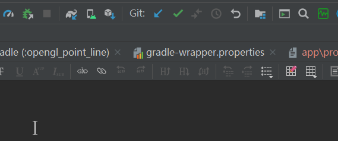
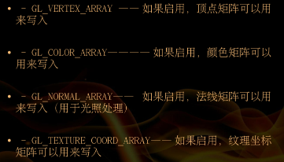
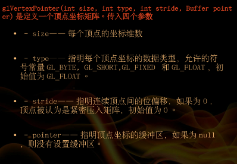
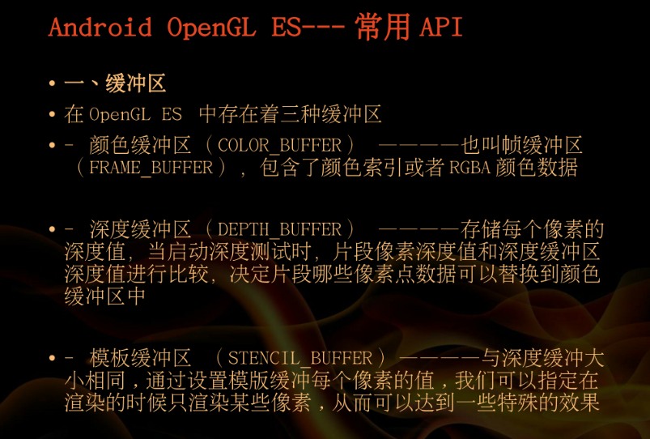
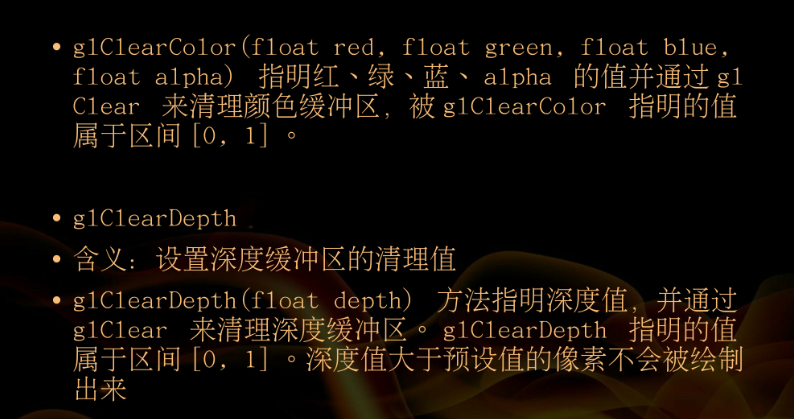
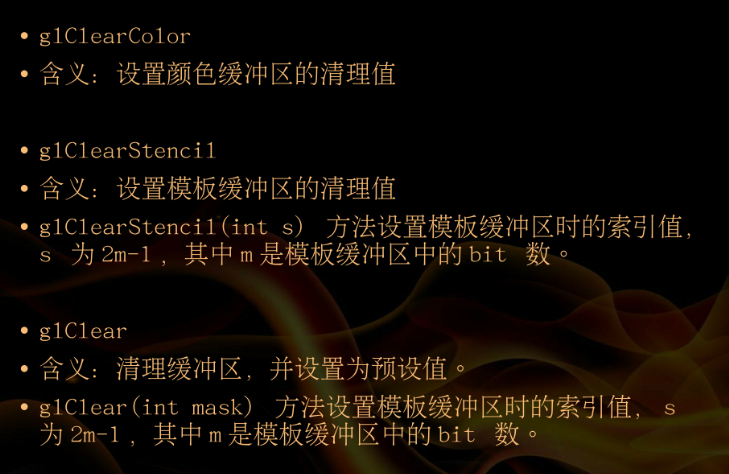
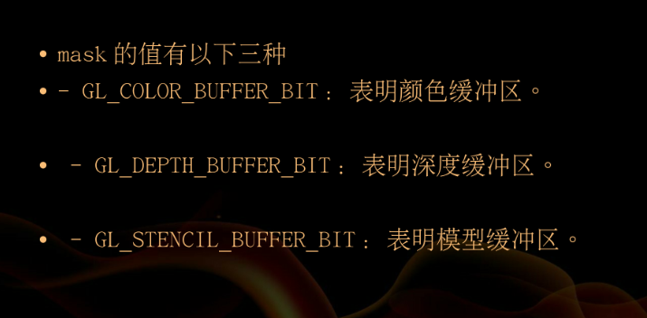

### 突然发现一大功能
AS的这个md插件，居然可以直接将截图直接保存为图片，并且加入到md文件中。6666



## OpenGL ES绘制点
1. 定义顶点数组
    x,y,z坐标（0f,0f,0f）
2. 获取浮点型缓冲数据
    ```
       // 定义一个工具方法，将int[]数组转换为OpenGL ES所需的IntBuffer
    private IntBuffer intBufferUtil(int[] arr) {
        IntBuffer mBuffer;
        // 初始化ByteBuffer，长度为arr数组的长度*4，因为一个int占4字节
        ByteBuffer qbb = ByteBuffer.allocateDirect(arr.length * 4);
        // 数组排列用nativeOrder
        qbb.order(ByteOrder.nativeOrder());
        mBuffer = qbb.asIntBuffer();
        mBuffer.put(arr);
        mBuffer.position(0);
        return mBuffer;
    }
    
    // 定义一个工具方法，将float[]数组转换为OpenGL ES所需的FloatBuffer
    private FloatBuffer floatBufferUtil(float[] arr) {
        FloatBuffer mBuffer;
        // 初始化ByteBuffer，长度为arr数组的长度*4，因为一个int占4字节
        ByteBuffer qbb = ByteBuffer.allocateDirect(arr.length * 4);
        // 数组排列用nativeOrder
        qbb.order(ByteOrder.nativeOrder());
        mBuffer = qbb.asFloatBuffer();
        mBuffer.put(arr);
        mBuffer.position(0);
        return mBuffer;
    }
   ```
3. 设置清屏颜色
    ```java
        @Override
        public void onSurfaceCreated(GL10 gl, EGLConfig config) {
            gl.glClearColor(0, 0, 1, 0);//参数分别是：红绿蓝，透明度
        }
        @Override
        public void onSurfaceChanged(GL10 gl, int width, int height) {
            gl.glViewport(0, 0, width, height);
        }
    ```
4. 允许设置顶点
    ```
        gl.glClear(GL10.GL_COLOR_BUFFER_BIT | GL10.GL_DEPTH_BUFFER_BIT);
        // 启用顶点坐标数据
        gl.glEnableClientState(GL10.GL_VERTEX_ARRAY);
     ```
    根据传入的int参数选择某项功能，array可以是下列符号常量：

    

5. 设置顶点
    `gl.glVertexPointer(3, GL10.GL_FLOAT, 0, pointData);`

    
6. 设置顶点颜色
    `gl.glColor4f(0, 1, 0, 0);绿色`

7. 设置点的大小
    `gl.glPointSize(50f);`
8. 绘制顶点
    函数原型：GL_APICALL void GL_APIENTRY glDrawArrays (GLenum mode, GLint first, GLsizei count);
    相似功能的函数是 glDrawElements。
    参数说明：
    mode，绘制方式，OpenGL2.0以后提供以下参数：GL_POINTS、GL_LINES、GL_LINE_LOOP、GL_LINE_STRIP、GL_TRIANGLES、GL_TRIANGLE_STRIP、GL_TRIANGLE_FAN。
    first，从数组缓存中的哪一位开始绘制，一般为0。
    count，数组中顶点的数量。

    顶点的顺序由vertexBuffer决定
9. 禁止顶点
     绘制完成后就禁止掉。
      gl.glFinish();
      gl.glDisableClientState(GL10.GL_VERTEX_ARRAY);










同时清理颜色缓冲区和深度缓冲区
`gl.glClear(GL10.GL_COLOR_BUFFER_BIT | GL10.GL_DEPTH_BUFFER_BIT);`